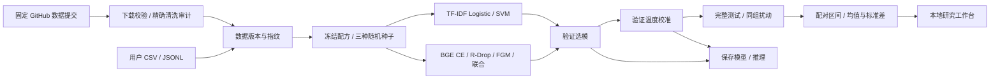

# 架构与范围 v0.2

数据层由 benchmark.py 负责固定来源、公开基准的 heldout 保留审计、预算抽样；data.py 负责常规导入、清洗、manifest 与指纹核验。模型层 training.py 管理 TF-IDF 或预训练分类模型、AMP / 调度、累积梯度、checkpoint 和统一推理；algorithms.py 独立实现 R-Drop 与 FGM。

研究层 research.py 冻结模型配方和源码指纹，串行执行 14 次实验；全部训练完成后统一校准 / 测试 / 压力测试，最后统计汇总。Suite 锁保护研究运行，training 锁保护单个训练。失败后可以复用已完成实验，未完成训练重新开始；不支持逐步恢复优化器状态。

FastAPI 提供本地 REST API，独立实验通过后台 worker 运行；研究套件由 CLI 进程运行，网页只读实际进度和结果。研究进行中禁止网页创建额外训练；研究的已有评测不经普通 API / CLI 覆盖。无构建依赖的 HTML / CSS / JS 展示校准和方法证据。

数据在 workspace/datasets/NAME；run.json 保存配置、来源、SHA、标签、环境、模型修订、实际设备、参数数、截断、训练状态与显存。模型为可信本地 joblib 或 safetensors；LoRA 保存 adapter / 分类头，基础模型修订留在元数据。

history、各划分 metrics/predictions/errors、calibration、robustness、test_arrays.npz 和 stress errors 均按 run 隔离。研究目录包含 protocol、perturbations、state、report；可分享数值快照在 docs/results，原始数据 / 权重不提交 Git。独立实验和合成自测不混入研究汇总。

当前范围是单机单标签分类。未实现近重复检测、业务外部盲测、超参搜索、断点续训、多 GPU、NER / SFT / DPO 或多人生产服务。固定种子不保证跨硬件逐位相同。服务仅绑定回环地址。
