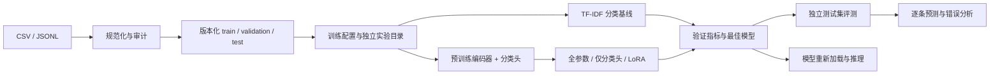

# 架构与实现范围

## 分层

- 数据层：data.py 负责规范化、审核、按类划分、manifest 与版本核验。原始数据不覆盖，已有版本不能重写。
- 实验层：training.py 分配实验、记录配置、执行基线或微调、保存最佳模型。每个工作区一次训练，进程锁在成功/失败时释放。
- 评测层：metrics.py 固定标签顺序计算指标；推理统一返回各类概率。evaluate_run 从保存模型重新加载，验证实际产物可用于推理。
- 服务层：api.py 提供本地 REST API，后台子进程执行训练/评测，主进程保持响应；CLI 同样使用核心模块。
- 展示层：无前端构建依赖的本地网页，显示数据版本、实验状态、每轮实测曲线、混淆矩阵和错误样本。

## 数据与实验产物

数据版本在 `workspace/datasets/NAME`，实验在 `workspace/runs/ID`。`run.json` 保存 config、dataset_sha256、split_sha256、labels、provenance、versions、实际设备和训练状态。曲线在 history.json；每个已评测划分有 metrics、predictions、errors 文件。

baseline 保存受信任的本地 joblib；Transformer 全参数/分类头保存模型 safetensors；LoRA 保存 adapter safetensors 和 classification head，基础模型版本记录在实验中。测试评测另行触发，重复查看同一测试集可能影响人的后续参数决策，所以正式研究还需要保留未接触的最终盲测集。

训练使用 FP32、固定学习率 AdamW；随机种子并不保证跨 GPU 型号或依赖版本逐位相同。模型会截断超出 max_length 的输入，训练/验证截断数量写入实验；用户需要结合真实文本长度选择设置。

## 当前边界与后续顺序

第一阶段已实现单标签分类完整闭环；内置示例是合成数据。

第二阶段建议接入带许可和来源的真实数据：按用户、时间或原始文档提供划分；检查近重复；固定多随机种子，评估不均衡类别与长文本。

第三阶段按实际需求增加断点续训、混合精度、学习率调度、独立概率校准、超参预算和漂移监控。第四阶段才扩展 NER、句向量或生成式 SFT：这些任务需要各自的数据 schema、目标函数和评测器，不能仅换一个模型名称。

这些后续功能未在 v0.1 实现。服务无多人认证，不应部署到公网。
