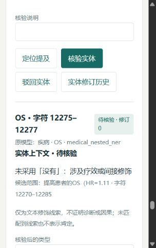

# v0.6：根据 GitHub 源码落实的改进

本轮通过 GitHub 插件检索项目，读取下列固定 commit 的关键代码。范围是列出的文件，未复现上游完整系统或引用其性能作为本项目分数。Git commit 与文件 blob 指纹见 [github_sources.json](medical-results/github_sources.json)。

## GlobalPointer：医学嵌套跨度与验证集选择

[CMeEE_GlobalPointer.py](https://github.com/bojone/GlobalPointer/blob/1e66ba360b3cbf6f785d2d93a1c0caa880932824/CMeEE_GlobalPointer.py) 使用类别独立的跨度监督、多标签分类损失和验证集最佳权重；识别阶段在分数阈值之上返回实体，并把 token 位置映射回原文。现有项目已经具备相应的跨度训练，不应把再次使用 GlobalPointer 宣称为新模型。上游脚本使用硬编码路径、不同长度预算和原始数据划分，不能直接比较分数。

落实：保留原始医学 checkpoint、训练协议及模型测试结果，新增独立解码对照。阈值只根据 1,500 条验证文本选择，低于 50 个验证实体的类别保持原阈值，所有试验参数与源代码哈希在评测前保存。类别阈值优化是本项目新增的实验，并非声称上游已实现这一优化。

## GLiNER：把跨度解码与模型推理分开

[gliner/decoding/decoder.py](https://github.com/urchade/GLiNER/blob/f3c945702b9b5cde381c27b95310c47909bcfd80/gliner/decoding/decoder.py) 在独立 decoder 中进行阈值过滤、有效跨度检查和按分数排序的重叠处理，可区分平面与嵌套 NER。它还提供真实类别掩码及跨度元数据。它的模型、token 单位与分数语义和本项目不相同，不能直接加载其分数阈值或概率解释。

落实：新增 `medical/decoding.py`，支持原始跨度与保留嵌套、剔除交叉跨度两种策略；重复位置的不同标签、包含与相邻关系保留。将解码策略与原始医学训练源码隔离，保证原 checkpoint 可回放。原始单阈值、扩展全局阈值、类别阈值共六个配置按验证集选择。

## medspaCy：实体级作用域，避免整句否定污染

[context_rule.py](https://github.com/medspacy/medspacy/blob/b7bb7d82f2e8fbadc9ab26d6b4c37578f8883c2c/medspacy/context/context_rule.py) 定义修饰方向、目标类型、最大范围以及 TERMINATE / PSEUDO；[context_modifier.py](https://github.com/medspacy/medspacy/blob/b7bb7d82f2e8fbadc9ab26d6b4c37578f8883c2c/medspacy/context/context_modifier.py) 计算和截断作用域，并判断修饰词是否能作用于某个实体。其默认语言资源不是本项目的中文医学文献标注模型。

落实：独立实现中文字符作用域，按目标类型限制否定、不确定、历史及家族经历线索，用转折词和分句标点终止范围。“未见肺炎，但存在咳嗽”只对肺炎保留否定线索；“无进展”“无创”“有无”等伪否定被排除。每个修饰词及作用范围保留全文 Unicode 偏移。未匹配到线索记为 unmarked，不能解释为肯定诊断。人工修订实体类型后重新计算上下文，全部修饰仍是待核验规则候选。

## Trialstreamer：PICO 片段、数据库与文献流程分层

[PICO_BERT.py](https://github.com/ijmarshall/trialstreamer/blob/a97cb8332c039e228ef42188c9d966440894e354/trialstreamer/PICO_BERT.py) 从数据库读取已抽取的 P / I / O 片段，拼接并计算向量。虽然文件说明提到 SciBERT，实际初始化使用 `bert-base-uncased`；该模块不是中文 PICO 标注器。其 README 的全量 PubMed 流程依赖 PostgreSQL / RobotReviewer，本项目未部署该流程。

落实：将实体上下文与记录来源线索分别存储，显式标记原文中的“本研究”、引用编号和试验名称。混合线索需核验；不把讨论里引用研究的 OS / PFS 值自动当成本研究结果，不从试验名称自动推断完整的组别或临床因果。

## 解码实验没有产生可靠提升

验证集 F1：原始 **58.62%** → 最佳候选 **58.95%**。复用之前报告过的 3,458 条保留文本：原始 **58.62%** → 候选 **58.47%**，差值 **−0.15 个百分点**；按文档配对 bootstrap 的 95% 区间约 **[−0.36, +0.10] 个百分点**。

因此默认推理仍使用原始医学模型及单阈值，未将这个解码候选作为默认策略。实验里的 promoted 只表示通过预设的验证集门槛，服务不自动加载其候选文件。这是复用旧保留集的后训练比较，不是全新未见测试集；没有训练种子稳定性结论，也没有医学专家标注业务准确率。

报告：[decoding_report.json](medical-results/decoding_report.json)、[decoding_protocol.json](medical-results/decoding_protocol.json)、[decoding_selection.json](medical-results/decoding_selection.json)。本轮交付的实际功能改善是实体修饰作用域、研究来源混合提示、版本化证据与可核验原文引用。

## 全文反例驱动的作用域收紧

两篇真实全文中的初始规则曾将“没有提高 OS”及“驱动基因阴性”关联到模型误标的疾病实体。现增加疾病中文标准名门槛、向后修饰距离限制及疗效 / 间接修饰排除，界面保留被阻止的线索、原文位置及原因。OS、ICIs、ALK 等未经核验的疾病预测不会因此自动获得疾病否定标签；这些限制仍可能漏掉有效表达，不等于已完成实体类型校正或医学上下文准确率验证。

收紧后两篇全文重新抽取：共 504 个实体提及、293 条候选证据，88 条记录包含引用 / 混合来源线索；8 个实体的可疑修饰被阻止，实际采用修饰为 0。所有原文偏移与引用通过检查。这些数量用于功能验收，不能作为上下文识别准确率。完整回归测试 110 项通过。

## 复现入口

先按 README 完成医学数据准备与原始六轮训练，再运行 `python scripts/improve_medical_decoding.py`。脚本使用 `workspace/medical/runs/ner-v1`，只执行推理和解码选择；已存在的实验目录会拒绝覆盖。`python scripts/export_medical.py` 核对原始代码 / 数据 / 权重并导出报告，`python scripts/verify_medical_snapshots.py` 可在不下载数据和模型的条件下验证公开快照完整性。快照验证通过不代表重新完成模型评测。
