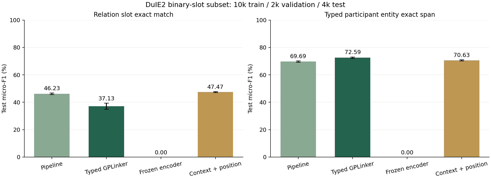

# 中文实体与关系抽取：本机实测结果

完成时间：2026-10-01T03:17:27.807438+00:00。所有数值来自实际 checkpoint 重载与完整测试，不使用历史分类分数。

按验证均值选择 **context_pipeline** 架构。测试关系 Micro-F1 **47.47% ± 0.27 pp**，关系参与者实体 Micro-F1 **70.63% ± 0.46 pp**。主模型均为 seed42/43 两次，± 是样本标准差。部署固定使用该架构 seed42，不按测试集挑种子。

## 数据与指标

固定训练 10,000、验证 2,000、测试 4,000 条；训练二元槽位 18,243 个、测试槽位 7,453 个。55 槽位 schema、26 实体类型。训练覆盖全部 55 槽位，验证与测试各覆盖 53；固定 55 槽位 Macro-F1 将无真实支持槽位也计入。

关系按带类型主客体表面字符串与 predicate/slot 精确匹配；实体按关系参与者的派生字符跨度匹配。官方复杂 object 拆为二元槽位，不等于完整多槽 SPO 评测。数据为清洗后的短文本固定子集，不是全量 DuIE 结果。

早期流程自测曾用前 12 条测试文本核验小规模 checkpoint 重载，未用于正式选模或阈值；正式原组五个模型在该组训练和验证选择后统一评测；上下文扩展两种子协议在原组测试开始前固定，并在两次扩展训练与验证选择后统一评测。另见 [排除这 12 条及难度分组核验](IE_SUBGROUPS.md)，不能称测试文本从未在任何流程中读取。

数据 SHA-256：`4115ed6b44477734b710da662ccbbc68f150b43ab08a7ad3cf2d6729321cb1f2`。来源、清洗、开源代码阅读范围见 [IE_RESEARCH.md](IE_RESEARCH.md)。

## 同预算对照

- **pipeline**：关系 F1 46.23% ± 0.53 pp；实体 F1 69.69% ± 0.49 pp；中性前缀压力下降 0.70 pp。
- **joint**：关系 F1 37.13% ± 2.24 pp；实体 F1 72.59% ± 0.53 pp；中性前缀压力下降 1.17 pp。
- **frozen_encoder**：关系 F1 0.00%（单次）；实体 F1 0.00%（单次）；中性前缀压力下降 0.00 pp。
- **context_pipeline**：关系 F1 47.47% ± 0.27 pp；实体 F1 70.63% ± 0.46 pp；中性前缀压力下降 0.31 pp。

上下文与位置增强相对原流水线，两种子测试均值变化 +1.23 pp；seed42 配对差值 +1.79 pp，条件95%区间 [+1.08, +2.49]。新增实体两侧/实体间均值池化与有向距离嵌入，共8个文本特征，保持原训练器、loss与训练预算。

两种子均值下，联合模型相对流水线变化 -9.10 pp。seed42 文本配对差值 -7.14 pp，条件 95% 区间 [-8.22, -5.90]。600 次配对文本 bootstrap，固定模型，不含训练种子总体不确定性，无多重比較校正。

## 诊断、消融与部署

流水线 seed42 输入真实实体时，关系 F1 75.80%；这是定位实体漏检/错边界影响的 oracle 诊断，不能当成部署表现。联合模型 seed42 去掉尾部交集后 F1 40.67%，属于同权重解码消融。冻结编码器为单种子同轮数独立训练，不等于多种子因子实验。

中性前缀压力使用同组 1,000 条测试文本、固定 seed2027，在原文前加“信息：”并平移所有跨度。它只说明前缀敏感性，不能代替真实业务外部测试。

默认 run：`20261001-024951-4e420649`。seed42 模型 24,850,923 参数，完整训练含验证和保存 633.6 秒，PyTorch 峰值分配显存 626.7 MiB。编码器版本 `7999e1d3359715c523056ef9478215996d62a620`。

## 可以写入简历的表述

> 实现中文实体与关系抽取系统，基于 DuIE2 清洗构建 10k/2k/4k 固定划分，微调中文预训练编码器，比较实体关系流水线、上下文位置增强与带类型跨度 GPLinker，完成两种子评测、实体误差级联诊断及解码/冻结消融；在当前二元槽位子集取得关系 Micro-F1 47.47%，提供原文定位和结构化 JSON 推理。

上述成绩不能写成官方 DuIE 榜单、完整 NER 指标、原创算法或生产上线效果。模型仅支持有限 schema，长文本窗口不保证跨窗口关系；分数未校准。

## 可核验证据

- [冻结协议](ie-results/protocol.json)：数据与代码指纹、全部配方、阈值/选模/测试政策。
- [逐次数值报告](ie-results/report.json)：每次种子、checkpoint SHA、完整槽位指标、配对统计、压力测试与诊断。
- [快照指纹](ie-results/fingerprints.json)。原始模型、逐轮历史和文本错误位于本地 workspace/ie/runs，不随 Git 分发。

## 增强方案未解决的问题

固定 seed42、排除早期12条后的3,988条中，金标实体对上多报错误角色由 578 增至 770；双方实体已检出但关系遗漏由 446 变为 398。F1提升不能说明角色混淆已解决，新增上下文与位置也未分别做独立训练的因子消融。

真实 HTTP 手写样例中，“《霸王别姬》的导演是陈凯歌，主演为张国荣和巩俐”仍多报陈凯歌为主演，并遗漏巩俐。出生日期、出生地和出版社不在当前DuIE2 schema中，相关样例未输出这些关系是能力范围限制，不能算成已支持槽位的漏检；实体标签也只覆盖关系参与者。作者关系及emoji定位核验通过；这些样例是功能检查，不是独立质量基准。完整结果见 [服务核验](ie-results/service_check.json)。

该项目目前适合作为可复验的 NLP 工程与实验项目。下一步应先补充独立实体监督、复杂/长尾槽位数据和业务外部集，再用验证集研究语义角色困难负例与损失配置；本轮未继续按测试错误调参。
