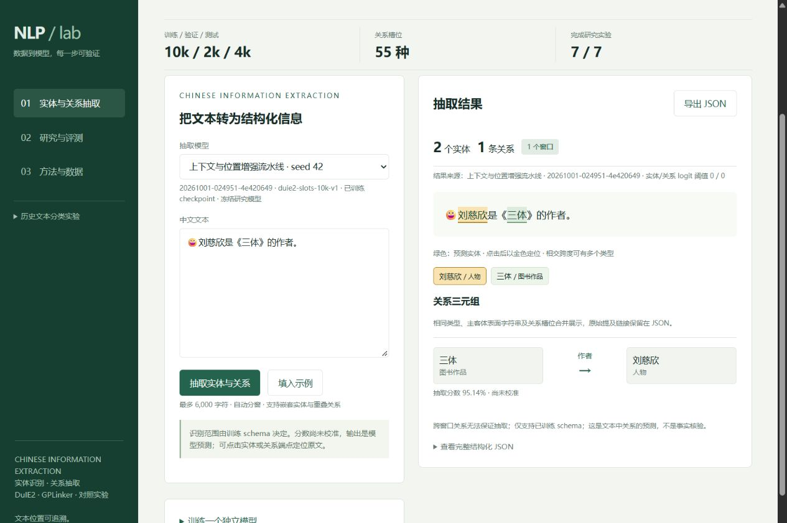
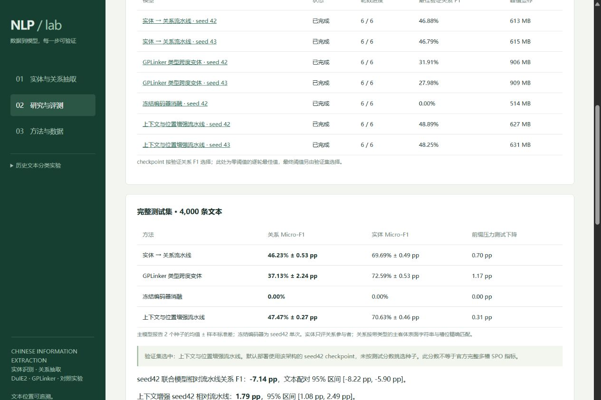

# 信息抽取交付核验

2026-10-01，本机 `C:/anaconda/envs/dsproject/python.exe`，RTX 3050 Ti Laptop 4GB。

- `python -m pytest -q`：47 passed，19 条依赖弃用警告。包括真实小型 BERT 的训练、反向传播、最佳权重重载、独立评测；上下文池化、方向距离、特殊 token/补齐掩码、Unicode 跨窗口位置；数据泄漏与指纹拒绝；研究产物及设备锁保护；API 和 JSON 附件导出。
- `node --check nlp_lab/web/ie.js` 和 Python compileall 通过。网页控制台未发现错误。
- 七个正式实验均完成 6 epochs、1,878 次有效优化器更新，AMP 跳过更新为 0。原组五次、扩展两次分别在各组训练和验证选择后评测完整 4,000 条；扩展源码与配方在原组测试开始前固定。
- 导出器核验每次 checkpoint SHA、配置、训练预算、55 槽位指标、测试金标槽位 7,453、参与者实体 11,204，以及逐文本计数重算 Micro-F1。模型、数据和原始错误正文保存在忽略的 workspace。
- `python -m scripts.check_ie_service` 通过真实 HTTP 检查：七次实验完成、默认模型与验证选择一致、Unicode 字符位置、主客体引用、提及合并、服务器附件 JSON 往返、非法路径 400、超长输入 422。
- 内嵌浏览器验证作者关系、实体点击定位及附件下载。浏览器下载的 JSON 与真实 HTTP 模型结果完全一致，快照见 [example-extraction.json](ie-results/example-extraction.json)。SHA-256：`09803a67312b937a74542c98c7a425875b3ead75555fc90c9d5a475afe8bc40c`。
- 桌面实测 client/scroll width 均 1,265；恢复正常侧栏窗口后均 304，无页面整体横向溢出。此前 390×844 移动布局也通过。研究表格在自身区域滚动。临时 viewport 已恢复。

## 指标与失败样例

增强模型两种子关系 Micro-F1 47.47% ± 0.27 pp，参与者实体跨度 Micro-F1 70.63% ± 0.46 pp。相对原流水线的关系均值提升 1.23 pp；这是当前 DuIE2 二元槽位短文本子集的结果，不是官方完整多槽 SPO 或完整 NER 成绩。

语义角色错误仍在，增强模型在 seed42 的金标实体对上多报错误角色更多（578 → 770）；手写电影例子仍将陈凯歌多报为主演并漏掉巩俐。出生日期、出生地与出版社不在当前schema中，对应关系未输出属于能力范围，而不是已支持槽位的漏检。样例通过指的是服务、位置和 JSON 正确，不代表所有语义预测正确。详见 [实测结果](IE_RESULTS.md)、[难度与错误分析](IE_SUBGROUPS.md)、[真实服务结果](ie-results/service_check.json)。

早期12条测试文本的流程自测披露及排除后的3,988条结果保留在报告。实体监督只覆盖关系参与者；位置按首次精确提及推导。没有把 oracle、历史分类成绩或手写例子作为可部署质量指标。
