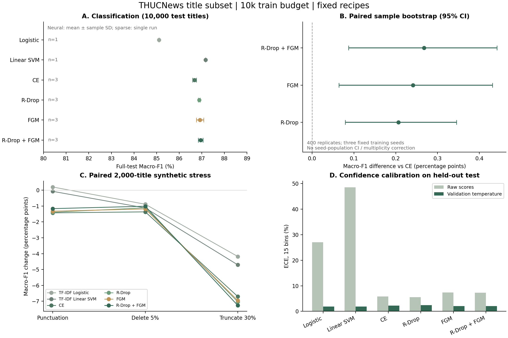

# 实测研究结果 v2

按验证集方法均值选择 **BGE R-Drop + FGM**；完整 test Macro-F1 为 **86.95% ± 0.11 个百分点**。训练 10,000 / 验证 9,991 / 测试 10,000，十类真实新闻标题。神经配方三种种子全部汇报，未选择最佳测试种子。

## 完整测试集对照

- **TF-IDF Logistic**：Macro-F1 85.10%（单次）；验证均值 84.35%；Accuracy 85.11%；单次训练均值 5.2s；校准前 / 后 ECE 27.07% / 1.93%。
- **TF-IDF Linear SVM**：Macro-F1 87.17%（单次）；验证均值 86.50%；Accuracy 87.21%；单次训练均值 2.2s；校准前 / 后 ECE 48.52% / 1.85%。
- **BGE CE**：Macro-F1 86.68% ± 0.09 个百分点；验证均值 86.22%；Accuracy 86.70%；单次训练均值 45.8s；校准前 / 后 ECE 5.82% / 2.24%。
- **BGE R-Drop**：Macro-F1 86.88% ± 0.04 个百分点；验证均值 86.62%；Accuracy 86.91%；单次训练均值 80.4s；校准前 / 后 ECE 5.53% / 2.40%。
- **BGE FGM**：Macro-F1 86.92% ± 0.16 个百分点；验证均值 86.48%；Accuracy 86.94%；单次训练均值 97.5s；校准前 / 后 ECE 7.38% / 2.05%。
- **BGE R-Drop + FGM**：Macro-F1 86.95% ± 0.11 个百分点；验证均值 86.67%；Accuracy 86.97%；单次训练均值 135.2s；校准前 / 后 ECE 7.28% / 2.08%。

## 改进幅度与取舍

- BGE R-Drop 相对 CE：+0.21 个百分点，条件 95% CI [+0.08, +0.35]。
- BGE FGM 相对 CE：+0.24 个百分点，条件 95% CI [+0.06, +0.43]。
- BGE R-Drop + FGM 相对 CE：+0.27 个百分点，条件 95% CI [+0.09, +0.44]。

验证选中方法相对 CE 的测试均值变化为 +0.27 个百分点；相对 Linear SVM 为 -0.23 个百分点。其训练时间约为 CE 的 2.95 倍。SVM 提供很有竞争力、训练便宜的基线，不能仅因模型复杂就忽略。

置信区间按测试样本行、类别分层配对重采样，三个已有训练种子固定；不包含训练种子总体不确定性，也未做多重比较校正。区间跨零的结果不足以在这套协议下确认改善。不同方法并非相同 FLOPs；时间取自本机单次训练，包括验证与保存。

## 同组扰动

- TF-IDF Logistic：同组原文 84.21%；标点 / 删字 / 截断相对变化 +0.20 / -0.88 / -4.18 个百分点。
- TF-IDF Linear SVM：同组原文 86.76%；标点 / 删字 / 截断相对变化 -0.07 / -1.12 / -4.71 个百分点。
- BGE CE：同组原文 86.65%；标点 / 删字 / 截断相对变化 -1.43 / -1.37 / -6.70 个百分点。
- BGE R-Drop：同组原文 86.74%；标点 / 删字 / 截断相对变化 -1.39 / -1.11 / -7.04 个百分点。
- BGE FGM：同组原文 86.74%；标点 / 删字 / 截断相对变化 -1.32 / -1.18 / -6.95 个百分点。
- BGE R-Drop + FGM：同组原文 86.64%；标点 / 删字 / 截断相对变化 -1.16 / -1.01 / -7.26 个百分点。

组合方法在标点和删字的 F1 退化较 CE 小，但截断退化更大；本轮不能声称它全面提升鲁棒性。

## 每类错误与后续研究依据

- 组合模型最弱类别之一 **股票**：三种子平均 F1 75.33%；主要混淆为 股票 → 财经，平均每次测试约 88.3 条。
- 组合模型最弱类别之一 **科技**：三种子平均 F1 81.27%；主要混淆为 科技 → 股票，平均每次测试约 47.0 条。
- 组合模型最弱类别之一 **财经**：三种子平均 F1 82.76%；主要混淆为 财经 → 股票，平均每次测试约 124.0 条。

这些错误只用于解释本轮结果和设计未来独立实验，未反向修改本轮配方。下一轮若扩大预算、调整编码器或处理短标题语义，应新建协议，并使用未参与本轮观察的最终外部数据验证。

每种扰动共 2,000 条，十类各 200。删除 / 截断可能改变语义，保留原标签且未人工复标；不能以此宣称自然分布外泛化。

## 证据与适用范围

数值来自已保存 checkpoint 的重新加载评测。14 次均验证了测试样本数、评分数组、指纹和同组压力测试数量；[report.json](results/report.json) 保存所有逐种子结果，[protocol.json](results/protocol.json) 保存训练前配方与算法指纹，[verification.json](results/verification.json) 保存产物校验。PDF 图可用于分享：[research_results.pdf](results/research_results.pdf)。

当前结论只覆盖单一公开标题域、10k 固定训练预算与 2 epochs。原仓库 180k 训练分数不可直接比较；近重复与预训练语料重叠未排除；三种子样本量有限。校准与 checkpoint 选择共用验证集，不是独立校准集。本轮是现有 R-Drop / FGM 的适配和因子实验，不是原创算法或论文级全面复现。

12 个神经实验均完成 2 epochs；预算 626 个更新窗口，FP16 动态缩放各跳过 5 次初始非有限梯度更新，实际成功更新均为 621 次。源码、模型修订和更新记录在 verification.json 中。
