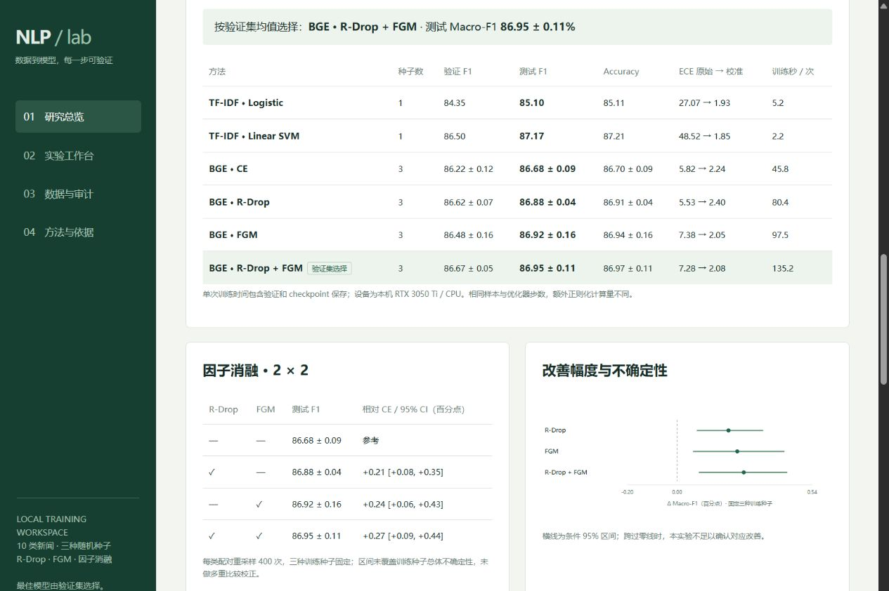

# 本机验证记录 v0.2

研究完整完成于 2026-10-01（Asia/Shanghai）。原始 run ID 和 artifact 时间按 UTC，故文件名日期可能是 20260930。

Python 3.13.12；PyTorch 2.6.0+cu124；Transformers 5.9.0；PEFT 0.19.1；scikit-learn 1.6.1；SciPy 1.17.1。RTX 3050 Ti Laptop 4GB。模型修订为 `7999e1d3359715c523056ef9478215996d62a620`。

## 实际运行

数据下载固定来源提交和 blob 校验通过，读取全部来源 200,000 标题。固定数据版本指纹 `f7c0af5c473788ac0165e359d3dce54930d1dced8fc8ca3a48f14c9278d8f5d5`；train 10,000、validation 9,991、test 10,000。

2 个稀疏基线、CE / R-Drop / FGM / 联合各 3 个种子，共 14 次训练与统一评测成功。12 个神经模型各完成 2 epochs，均为 621 个实际 optimizer 更新 / 5 次 AMP skip。测试数组重新计算 F1 与汇总吻合；14 份测试指纹均一致；每个 run 四组压力测试各 2,000 行。五个协议算法文件 SHA-256 与运行时保持一致。

`python -m scripts.export_research` 成功生成报告、校验清单、逐类错误分析及 PNG / PDF 图，图已视觉核验。完整实测结果和限制在 [RESULTS_V2.md](RESULTS_V2.md)。

## 自动验证

`python -m pytest -q`：**25 passed，20.96s**。覆盖精确清洗、标签冲突、跨划分泄漏、指纹篡改、词表仅拟合训练数据、SVM 打分标签顺序、模型保存重载；全参数 / LoRA / head 与四种目标的微型真实训练；短梯度累积窗口；KL 参考值和两个分布梯度；FGM 微批次方向、L2 范数、异常恢复与零梯度；温度拟合、argmax 保持、配对 bootstrap；确定性同组扰动；API 来源 / 路径检查、套件保护和研究资源返回。

测试不访问网络、不下载模型，神经单元测试使用本地生成的小随机模型。全规模实测单独使用实际预训练 BGE 权重。已安装依赖产生 Starlette / sklearn / tokenizer 弃用提示，未影响测试；没有全局升级环境。

网页内联脚本及 research.js 均通过 `node --check`；研究 HTML / JS / CSS 路由可访问。浏览器核对真实 14/14 状态、验证选中方法、测试均值 / 标准差、消融 CI、扰动与资源指标。桌面 1280×900 和原窄面板布局核验，临时尺寸已恢复。

实际点击方法按钮能打开 seed 42 的研究 run；冻结研究评测按钮不可覆盖产物。神经模型在工作台推理体育、科技和股票三条文本均返回对应类别，且显示已拟合温度。CLI 重载联合模型做两条推理，temperature_scaled=true。

## 范围

这是本机单域、固定预算研究验证；没有验证其他 GPU、多机、多人服务、真实业务分布外数据或生产部署。合成扰动和少量种子不能支持普适性能声明。历史 v0.1 合成样本的验证记录保留在 VALIDATION.md，未混入本轮报告。
